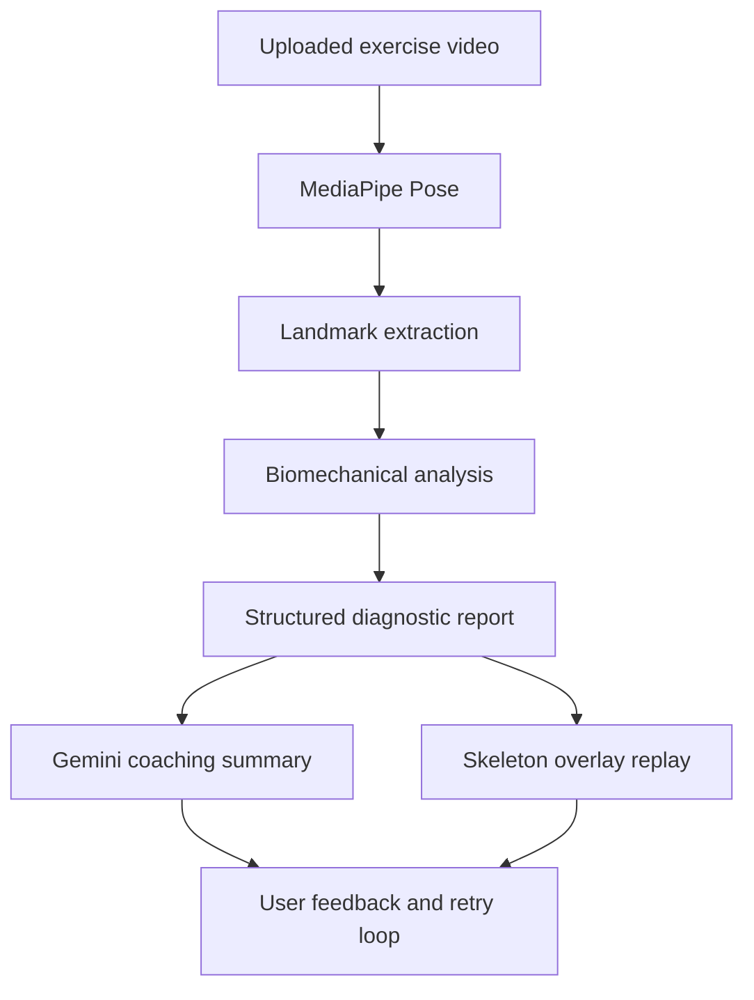
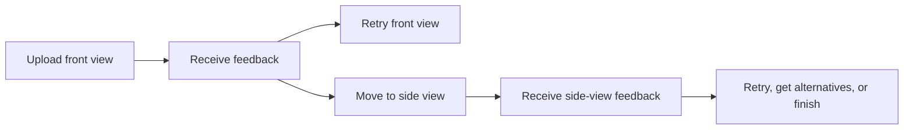

# FormSense+

**FormSense+** is an interactive AI exercise coach that analyzes short workout videos and turns pose-estimation signals into clear, actionable feedback about exercise form.

The project was developed as an academic Human-AI Interaction prototype. Its goal is to support beginner and intermediate trainees who want technique feedback but do not always have access to a personal trainer.

[Live demo](https://formsenseplus.netlify.app/)

> FormSense+ is an educational prototype. It is not medical advice, does not replace a certified trainer, and should not be used to train through pain or injury.

## Project motivation

Many gym trainees learn exercises through static videos, short social-media clips, or trial and error. This makes it difficult to understand whether they are actually performing a movement correctly. Incorrect form can reduce training effectiveness and increase injury risk, especially for beginners who do not yet know what to look for.

FormSense+ addresses this gap by creating a closed feedback loop:

1. The user uploads a short exercise video.
2. The system extracts body landmarks using pose estimation.
3. Custom biomechanical logic evaluates movement quality.
4. The result is translated into simple coaching feedback.
5. The user can retry, inspect the skeleton overlay, or continue to another camera angle.

Rather than merely counting repetitions, the system focuses on concrete form deviations, confidence-aware feedback, and iterative learning.

## Key features

- Video-based form analysis for **Squats** and **Bicep Curls**.
- Pose estimation using **MediaPipe Pose**, extracting 33 body landmarks per frame.
- Custom JavaScript logic for biomechanical analysis:
  - joint angles;
  - range of motion;
  - left/right symmetry;
  - tempo and stability;
  - exercise-specific thresholds.
- Front-view and side-view workflow for more complete technique evaluation.
- Structured feedback separated into:
  - positive observations;
  - issues to correct;
  - uncertain findings when landmark confidence is low.
- AI-generated coaching summary using Gemini.
- Skeleton-overlay replay that helps users see what the system detected.
- Smart recommendations for related exercises that target similar muscles.

## System architecture



The system combines deterministic computer-vision analysis with generative AI. The core evaluation logic is not left to the LLM. Instead, the LLM receives a structured report produced by the vision pipeline and translates it into user-friendly coaching language.

## Intelligence design

FormSense+ uses a hybrid intelligence approach.

### 1. Algorithmic intelligence

The algorithmic layer processes user-submitted videos with MediaPipe Pose and extracts skeletal landmarks across frames. From these landmarks, the system computes biomechanical features such as:

- knee, hip, elbow, shoulder, and trunk angles;
- squat depth and bicep-curl range of motion;
- left/right symmetry;
- movement tempo;
- stability and visible posture deviations;
- landmark confidence scores.

These metrics are compared against exercise-specific reference constraints and calibrated thresholds. The goal is to detect meaningful form deviations while avoiding feedback when the visual evidence is unreliable.

### 2. LLM-based coaching layer

The Gemini layer receives a compact diagnostic summary that includes:

- the selected exercise;
- positive technical observations;
- detected form issues;
- uncertainty notes;
- confidence-related limitations.

Gemini then transforms this structured information into concise, encouraging coaching feedback. It also generates related exercise recommendations with short explanations and links to relevant execution videos.

This division keeps the biomechanical judgment grounded in deterministic logic while using the LLM for explanation, prioritization, and user-friendly communication.

## Human-AI interaction principles

The design follows three central HAI principles:

### Clear AI role

FormSense+ is framed as an assistive coach, not as an authority that controls the user. It does not enforce behavior, automatically correct the user, or claim certainty where the visual evidence is weak.

### Actionable and focused feedback

The system avoids overwhelming the user with too many corrections at once. Feedback is written in a coaching-oriented style, using short and practical cues such as focusing on knee tracking, movement depth, or arm control.

### Convenient learning loop

The intended workflow is iterative:



This supports gradual skill acquisition rather than one-time evaluation.

## Supported exercises

| Exercise | Current analysis focus |
| --- | --- |
| Squat | depth, knee tracking, trunk posture, symmetry, visible stability |
| Bicep Curl | elbow control, range of motion, arm symmetry, tempo, shoulder compensation |

The current prototype supports a focused exercise set so that each movement can receive exercise-specific rules instead of generic pose feedback.

## Evaluation

The prototype was evaluated through an end-to-end usability study with five participants:

- 3 Technion students;
- 2 non-Technion participants.

Participants completed the full workflow: selecting an exercise, uploading the required videos, and interpreting the AI feedback.

### Main positive findings

- Users found the interface clear, organized, and easy to use without external explanation.
- Participants said they would use this type of tool in real life, especially in early training stages.
- The step-by-step workflow made the system feel approachable.
- The smart exercise recommendations were perceived as useful beyond the immediate correction.

### Main improvement suggestions

- Add reference images for correct camera placement.
- Highlight the exact limb and moment where an error occurs.
- Add a side-by-side “perfect rep” comparison.
- Show a progress bar during video processing.

### Lessons learned

The evaluation showed that strong AI logic is not enough. For this kind of system to be useful, the experience must be simple, linear, and understandable. Users valued clarity and practical guidance more than technical complexity.

## LLM-as-user evaluation

In addition to human testing, the project used an LLM-based evaluation strategy. The model was instructed to act as a senior strength and conditioning coach and critically review the exercise-analysis logic.

This helped identify professional blind spots that regular users were less likely to notice, such as:

- the difference between skeleton-based confidence and true biomechanical certainty;
- risks of overgeneralized coaching rules;
- missing signals that are hard to infer from pose landmarks, such as breathing, bracing, pain, fatigue, and individual anatomy.

The comparison was useful because human users focused mainly on usability, while the LLM persona focused mainly on professional coaching logic and safety limitations.

## Technical stack

| Area | Technology |
| --- | --- |
| Frontend | HTML, CSS, vanilla JavaScript |
| Pose estimation | MediaPipe Pose |
| Biomechanical logic | Custom JavaScript geometry and threshold rules |
| AI feedback | Google Gemini |
| Markdown rendering | Marked.js |
| Hosting | Netlify |
| API protection | Netlify Functions |

## Repository structure

```text
formsense-plus/
├── index.html
├── README.md
├── netlify.toml
├── .gitignore
├── .env.example
└── netlify/
    └── functions/
        └── gemini.js
```

## Running locally

The visual interface is contained in `index.html`, but the AI feedback requires a serverless function and a Gemini API key.

1. Install or run the Netlify CLI:

```bash
npx netlify dev
```

2. Create a local `.env` file based on `.env.example`:

```bash
GEMINI_API_KEY=your_gemini_api_key_here
```

3. Start the project from the repository root:

```bash
npx netlify dev
```

4. Open the local URL printed in the terminal.

## Deployment

To deploy the project with Netlify:

1. Push the repository to GitHub.
2. Import the repository into Netlify.
3. Keep the site as a static frontend with Netlify Functions enabled.
4. Add `GEMINI_API_KEY` as an environment variable in Netlify.
5. Deploy the site.

The browser calls the Netlify Function at:

```text
/.netlify/functions/gemini
```

The function then calls Gemini from the server side. This prevents the API key from being exposed in the frontend code.

## Security note

The original prototype used a Gemini API key directly inside the client-side HTML/JavaScript file. That approach exposes the key to anyone who opens the website source.

In this repository, the key was moved out of the browser and into a Netlify Function. Before deploying publicly, the previously exposed key should be revoked or rotated, and a fresh key should be configured only as an environment variable.

Do not commit a real `.env` file to GitHub.

## Current limitations

- The prototype currently supports only Squats and Bicep Curls.
- Feedback depends on camera angle, visibility, lighting, and pose-landmark quality.
- The system cannot detect every important training factor, such as pain, breathing, bracing, fatigue, load selection, or individual anatomical constraints.
- The current version is upload-based rather than fully real-time.
- Some coaching rules are threshold-based and may not fit every trainee or goal.

## Future work

Planned extensions include:

- expanding the exercise library to movements such as Deadlift and Bench Press;
- adding user profiles and long-term progress tracking;
- moving from upload-based analysis to real-time feedback;
- highlighting the exact limb and timestamp of detected errors;
- adding ideal-repetition comparison videos;
- improving personalization based on user level, goals, and training context.

## Authors

- **Lior Malachi**
- **Shachar Goralnik**

Academic prototype developed as part of a Human-AI Interaction project.
