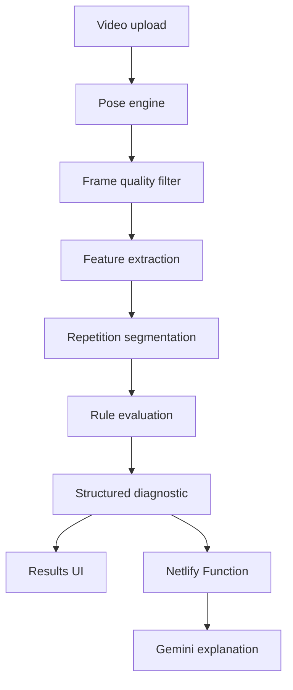

# FormSense+

FormSense+ is a browser-based exercise-form analysis application. Users upload front- and side-view workout videos, MediaPipe Pose extracts skeletal landmarks locally in the browser, deterministic exercise-specific rules evaluate movement metrics, and an optional Gemini layer converts the structured diagnostic into concise coaching language.

The project currently supports **Squat** and **Bicep Curl**. It is an educational movement-analysis tool, not a medical device and not a replacement for a qualified trainer.

## Why this project is different

The LLM is not responsible for deciding whether a repetition was performed correctly. The core judgment remains deterministic and inspectable:

1. MediaPipe estimates 33 pose landmarks.
2. Frames are filtered using the visibility of the landmarks required by each analysis.
3. Exercise- and view-specific features are extracted.
4. A lightweight high-low-high state machine detects supported repetition cycles.
5. Robust aggregations such as percentiles, medians and ranges are compared with configured rules.
6. Every result is stored as a structured finding with a measurement, severity and tracking confidence.
7. Gemini receives that diagnostic and explains it without changing the underlying judgment.

## Core features

- Front- and side-view workflow for Squat and Bicep Curl
- In-browser MediaPipe Pose processing
- Skeleton overlay, replay and downloadable analyzed video
- Exercise-specific biomechanical feature extraction
- Repetition-aware analysis for complete supported movement cycles
- Honest video-level fallback when no complete repetition is detected
- Per-finding landmark-visibility confidence
- Good, correction and uncertainty result categories
- Severity-prioritized corrections
- Secure Gemini calls through a Netlify Function
- Camera-position guidance and processing progress
- User-friendly failure and retry states
- Dependency-light tests using the native Node test runner

## Architecture



All video frames and landmarks remain in the browser. Only the compact diagnostic JSON is sent to the serverless function when the user requests AI-generated text.

## Repository structure

```text
├── index.html                         App markup
├── css/styles.css                     Visual system and responsive layout
├── assets/guides/                     Camera-position illustrations
├── js/app.js                          Application orchestration
├── js/config/                         Thresholds, landmarks and exercise metadata
├── js/core/                           State and diagnostic data model
├── js/utils/                          Geometry and statistics utilities
├── js/vision/                         Pose engine, video loop and overlay rendering
├── js/analysis/                       Confidence, findings and rep segmentation
├── js/analysis/exercises/             Squat and Bicep Curl analyzers
├── js/services/                       AI client and coaching service
├── js/ui/                             Workflow, progress and results rendering
├── netlify/functions/gemini.mjs       Server-side Gemini gateway
├── samples/                           Example structured diagnostics
├── tests/                             Unit tests
└── docs/MANUAL_QA.md                  Browser and workflow QA checklist
```

## Diagnostic contract

Each finding records what was evaluated and how:

```json
{
  "id": "curl_elbow_drift",
  "label": "Elbow drift",
  "status": "correction",
  "severity": "moderate",
  "confidence": 91,
  "confidenceType": "landmark_visibility",
  "message": "Forward elbow drift was detected.",
  "cue": "Keep the upper arm stable and let the forearm create most of the visible movement.",
  "measurement": {
    "value": 27.4,
    "unit": "degrees",
    "aggregation": "95th_percentile"
  },
  "landmarks": [12, 14]
}
```

`confidence` is explicitly a MediaPipe landmark-visibility measure. It is not a validated probability that a coaching conclusion is correct.

## Local development

### Requirements

- Node.js 20 or later
- A modern Chromium-based browser is recommended
- A Gemini API key only if AI summaries and recommendations are required

### Setup in PyCharm

1. Extract or clone this repository into a new folder.
2. In PyCharm, choose **File → Open** and select the `formsense-plus` folder.
3. Do not create a Python virtual environment; this is a JavaScript project.
4. Open PyCharm's terminal and run:

```bash
npm install
```

5. Copy `.env.example` to `.env` and set your key:

```text
GEMINI_API_KEY=your_key_here
```

6. Start the local Netlify environment:

```bash
npm run dev
```

Open the local URL printed by Netlify CLI. Opening `index.html` directly is not sufficient because ES modules and the serverless function require an HTTP development server.

The deterministic analysis remains usable when Gemini is unavailable; only the optional AI text will show an error state.

## Tests

```bash
npm test
```

The tests cover geometry, statistics, visibility filtering, severity/uncertainty routing and repetition segmentation.

## Netlify deployment

1. Push the repository to GitHub.
2. In Netlify, choose **Add new site → Import an existing project**.
3. Select the GitHub repository.
4. Netlify reads `netlify.toml`; no build command is required and the publish directory is `.`.
5. Add `GEMINI_API_KEY` under the site's environment variables and make it available to Functions.
6. Optionally set `GEMINI_MODEL`; otherwise the function uses `gemini-2.5-flash`.
7. Deploy and run the manual QA checklist on the production URL.

Never add the real key to `.env.example`, JavaScript files, Git history, or `netlify.toml`.

## Security decisions

- The Gemini key exists only in the Netlify Function environment.
- The client cannot submit an arbitrary prompt; it can request only an allowed action with a validated diagnostic.
- The function validates request size, schema, exercise and action.
- AI responses are rendered using `textContent` and DOM construction instead of unsanitized `innerHTML`.
- Provider failures are logged server-side without returning raw provider details to the browser.
- Security headers are configured in `netlify.toml`.
- Generated responses are never allowed to override deterministic findings.

## Repetition analysis

Repetition detection is intentionally limited to the two supported movement families. A smoothed joint-angle signal is processed with hysteresis:

- A repetition becomes ready in the extended/standing position.
- It must cross a configured bottom/contraction threshold.
- It is counted only after returning to the starting range.
- Implausibly short or long cycles are rejected.

Squats use knee flexion as the cycle signal. Bicep curls use elbow flexion. When this process does not find a reliable complete cycle, the report says `video-level`; it does not claim repetition-level aggregation.

## Evaluation background

The original academic prototype was evaluated with five users. They praised the linear workflow and visual design, while requesting clearer camera guidance, error localization, comparative examples and better progress visibility. This version directly addresses camera guidance and progress visibility and creates landmark mappings that can support deeper replay localization later.

An additional persona-based LLM review highlighted an important limitation: visibility confidence is not the same as biomechanical certainty, and geometric rules cannot observe pain, breathing, bracing, fatigue, load or individual context. Those limitations are now explicit in the product and documentation.

## Current limitations

- Only Squat and Bicep Curl are supported.
- Thresholds are heuristic/calibrated reference values, not clinically validated standards.
- Pose estimation from a single 2D camera is sensitive to camera angle, occlusion, lighting and loose clothing.
- The system does not know the user's anatomy, load, injury history, pain, goal or experience level.
- Confidence measures landmark visibility, not correctness probability.
- Rep segmentation assumes the recording contains recognizable complete high-low-high cycles.
- Skeleton replay depends on browser `MediaRecorder` support; unsupported browsers fall back to the original uploaded video.
- AI recommendations link to YouTube search results rather than a curated technique library.
- The application provides post-set analysis, not real-time safety intervention.

## Future work

- Per-frame rule evaluation and precise issue highlighting during replay
- A licensed, synchronized “reference repetition” comparison
- Additional exercises with separately validated feature sets
- Calibration datasets with diverse body types, camera setups and execution styles
- Formal comparison against annotations from qualified strength coaches
- Optional session history and longitudinal progress tracking

## Project origin

FormSense+ began as an academic Human-AI Interaction project by **Lior Malachi and Shachar Goralnik**. This repository is a production-oriented evolution of that prototype, preserving the original product concept while strengthening its architecture, validation, security and technical honesty.

Before publishing under an open-source license, both project contributors should agree on the chosen license.

## Technology

- Vanilla JavaScript ES modules
- MediaPipe Pose and Drawing Utilities
- HTML Canvas and MediaRecorder
- Gemini API
- Netlify Functions and Netlify hosting
- Node.js native test runner

Useful references: [MediaPipe Pose Landmarker for Web](https://ai.google.dev/edge/mediapipe/solutions/vision/pose_landmarker/web_js), [Gemini model documentation](https://ai.google.dev/gemini-api/docs/models), and [Netlify Functions](https://docs.netlify.com/build/functions/overview/).
