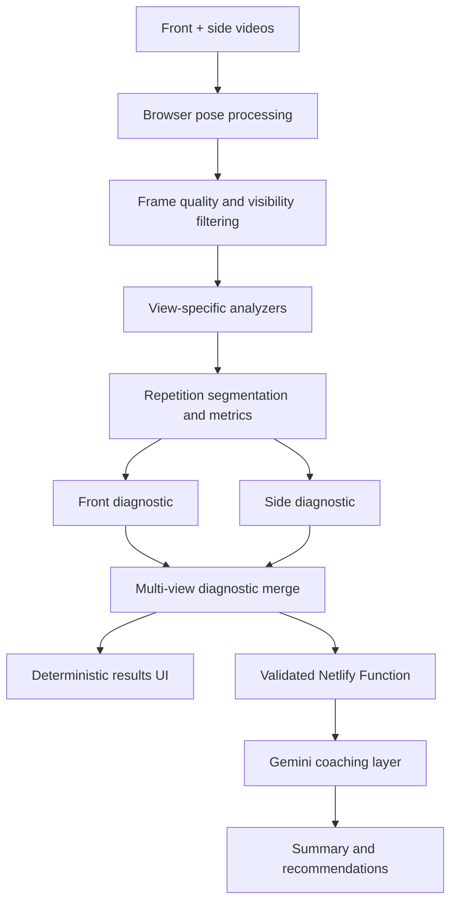
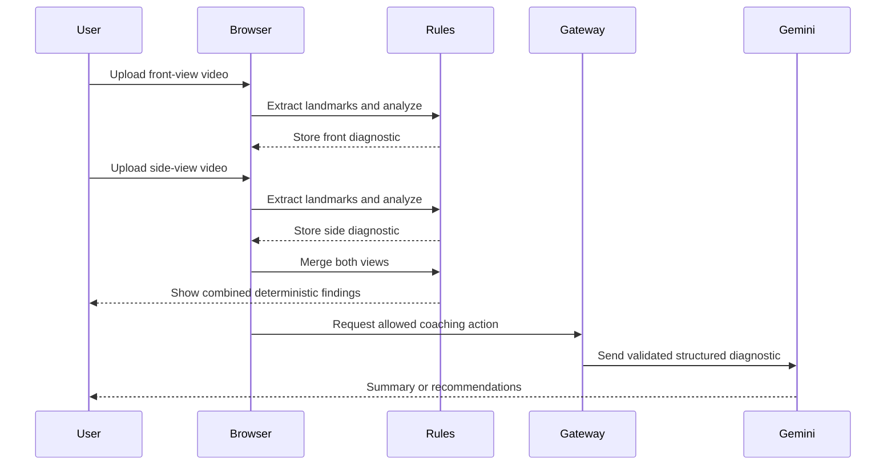

# FormSense+

**A hybrid-intelligence exercise-form analysis system for structured, explainable post-set coaching.**

FormSense+ analyzes front- and side-view workout videos, extracts pose landmarks locally in the browser, evaluates exercise-specific biomechanical metrics with deterministic rules, and uses an optional LLM layer to translate the resulting structured diagnostic into clear coaching language.

The current version supports **Squat** and **Bicep Curl**. It is an educational movement-analysis tool, not a medical device and not a substitute for a qualified coach or healthcare professional.

## Project motivation

Beginner and intermediate trainees often practice without continuous access to professional supervision. Static tutorials can demonstrate a movement, but they cannot observe a user's attempt, identify what happened, or prioritize the next correction. Personal coaching provides that feedback, but it may be expensive or unavailable.

FormSense+ explores how computer vision and generative AI can make post-set feedback more accessible while preserving technical transparency. The project is designed around three principles:

1. **Measure before explaining.** Coaching conclusions originate from inspectable geometric metrics, not from an unconstrained LLM judgment.
2. **Use complementary camera views.** Front and side recordings reveal different aspects of movement and are combined before final feedback is shown.
3. **Communicate uncertainty honestly.** Weak visual evidence is surfaced as uncertainty instead of being presented as a confident correction.

## Key features

- Guided front- and side-view workflow for Squat and Bicep Curl
- One combined assessment produced only after both required views are analyzed
- In-browser MediaPipe Pose processing with a skeletal overlay
- Exercise- and view-specific biomechanical feature extraction
- Complete-repetition detection using smoothed movement signals and hysteresis
- Repetition-level extrema and robust aggregation across detected repetitions
- Explicit video-level fallback when no complete repetition is available
- Confidence propagation from landmark visibility and usable sample support
- Separate **To preserve**, **To improve**, and **Uncertainty** result categories
- Severity-prioritized deterministic findings
- Optional Gemini-generated summary and related-exercise recommendations
- Analyzed-video replay and download when browser recording is supported
- Camera-position guidance, progress indication, retry flows, and actionable errors
- Serverless API-key protection and request validation through Netlify Functions
- Dependency-light automated tests using Node's native test runner

## System architecture



The raw videos, per-frame landmarks, feature extraction, and rule evaluation remain in the browser. When generative feedback is requested, only a compact structured diagnostic and an allowed action are sent to the serverless gateway. The Gemini API key never reaches the client.

## Intelligence design

FormSense+ uses a **hybrid intelligence approach**: deterministic analysis establishes what the system observed, while the LLM communicates those observations in accessible language. This separation prevents the generative layer from silently redefining the biomechanical result.

### 1. Algorithmic intelligence

The analytical pipeline performs the core evaluation:

1. **Pose estimation** - MediaPipe extracts 33 normalized body landmarks and visibility values from each usable video frame.
2. **Geometry correction** - normalized coordinates are adjusted for video aspect ratio before angle and distance calculations.
3. **Quality filtering** - a metric is evaluated only when every landmark it requires is present and sufficiently visible.
4. **Feature extraction** - exercise- and view-specific geometry is converted into angles, normalized displacements, symmetry measures, range-of-motion measures, and stability signals.
5. **Repetition segmentation** - a smoothed joint-angle signal and hysteresis identify complete high-low-high movement cycles. Implausibly short or long cycles are rejected.
6. **Repetition-aware aggregation** - raw extrema are calculated inside each complete repetition and then combined robustly across repetitions. This avoids treating an arbitrary frame as the representative bottom or contraction position.
7. **Rule evaluation** - aggregated measurements are compared with configured exercise-specific reference ranges.
8. **Confidence routing** - landmark visibility and sample support determine whether a finding is presented as reliable feedback or uncertainty.

Examples of the measured movement characteristics include:

| Exercise | Front view | Side view |
| --- | --- | --- |
| Squat | shoulder symmetry, lateral torso stability, medial knee displacement relative to the hip-ankle axis | knee-flexion depth, torso angle, forward shin angle, heel stability |
| Bicep Curl | shoulder symmetry, torso stability, frontal upper-arm movement | elbow extension and contraction, visible upper-arm drift |

These metrics are intentionally view-specific. A 2D front view should not be treated as equivalent to a side view for depth, and the system does not claim to infer unobservable properties such as pain, breathing, internal bracing, fatigue, or load suitability.

### 2. Multi-view diagnostic reasoning

The front and side analyses are not presented as two unrelated verdicts. FormSense+ stores both structured diagnostics and merges them into a single result after the second recording:

- findings from complementary views are retained together;
- duplicate or weaker proxy findings are resolved deliberately;
- side-view squat depth supersedes the less reliable front-view depth proxy;
- severity and confidence remain attached to their original measurements;
- the LLM receives one combined diagnostic rather than generating a separate narrative after every upload.

This design lets each camera angle contribute what it can observe reliably without pretending that either view alone captures the entire movement.

### 3. LLM-based coaching layer

Gemini receives a compact, validated representation of the deterministic result. Its role is limited to:

- summarizing the most important findings;
- explaining them in concise, supportive language;
- prioritizing corrections without changing their rule-based status;
- suggesting related exercises when the user explicitly requests them.

The server constructs the provider prompt from validated diagnostic fields. The browser cannot submit an arbitrary prompt or instruct the model to override the analysis. Structured response schemas are used so malformed output can be detected and shown as an explicit retryable error.

### Responsibility boundary

| Component | Responsible for | Not responsible for |
| --- | --- | --- |
| MediaPipe Pose | estimating visible skeletal landmarks | deciding whether technique is correct |
| Rule-based analysis | computing metrics, applying thresholds, assigning status and severity | writing open-ended coaching narratives |
| Confidence layer | describing tracking quality and sample support | estimating clinical or biomechanical certainty |
| Gemini | explaining and prioritizing the supplied diagnostic | inventing measurements or reversing deterministic findings |
| User | deciding whether and how to apply the feedback | blindly accepting the system as professional advice |

## Analysis lifecycle



## Diagnostic model

Each finding records what was evaluated, the result, the underlying measurement, its aggregation method, and the visual evidence supporting it:

```json
{
  "id": "curl_elbow_drift",
  "label": "Upper-arm movement",
  "status": "correction",
  "severity": "moderate",
  "confidence": 91,
  "confidenceType": "landmark_visibility_and_sample_support",
  "message": "Pronounced upper-arm movement was detected during the curl.",
  "cue": "Keep the upper arm stable and let the forearm create most of the visible movement.",
  "measurement": {
    "value": 27.4,
    "unit": "degrees",
    "aggregation": "median_rep_angle_range"
  },
  "landmarks": [12, 14]
}
```

Positive findings intentionally do not carry corrective cues. A cue is reserved for a finding that requires action, reducing repetition and avoiding contradictory feedback.

> **Confidence semantics:** the confidence score combines MediaPipe landmark visibility with the amount of usable sample support. It is not a validated probability that the biomechanical conclusion is correct.

## Repetition-aware measurement

Squats use knee flexion as the repetition-cycle signal; bicep curls use elbow flexion. Repetition boundaries are detected on a smoothed signal, but the reported range-of-motion extrema are calculated from the raw valid measurements inside each complete repetition.

For a metric that depends on the lowest or most contracted point, the process is:

1. detect each complete repetition;
2. calculate the relevant raw extremum inside that repetition;
3. reject unusable repetitions or samples;
4. combine the per-repetition values using a robust statistic, normally the median;
5. label a video-level fallback explicitly if no complete repetition can be detected.

This distinction is important: smoothing supports stable segmentation, while raw within-repetition measurements preserve the actual observed movement range.

## Repository structure

```text
├── index.html                         Application markup and entry point
├── css/styles.css                     Visual system and responsive layout
├── assets/guides/                     Camera-position illustrations
├── js/app.js                          Application orchestration
├── js/config/                         Exercise metadata, landmarks and thresholds
├── js/core/                           Application state and diagnostic model
├── js/utils/                          Geometry and statistics utilities
├── js/vision/                         Pose engine, processing loop and overlay
├── js/analysis/                       Confidence, merging and repetition logic
├── js/analysis/exercises/             Squat and Bicep Curl analyzers
├── js/services/                       AI client and coaching service
├── js/ui/                             Workflow, progress and results rendering
├── netlify/functions/gemini.mjs       Validated server-side Gemini gateway
├── samples/                           Example structured diagnostics
├── tests/                             Automated test suite
├── docs/MANUAL_QA.md                  Browser and workflow QA checklist
└── netlify.toml                       Hosting, functions and security configuration
```

## Technology stack

- **Frontend:** HTML5, CSS3, Vanilla JavaScript with ES modules
- **Computer vision:** MediaPipe Pose and Drawing Utilities
- **Video processing:** HTML Video, Canvas, `requestVideoFrameCallback`, `MediaRecorder`
- **Generative AI:** Gemini API with structured JSON output
- **Backend boundary:** Netlify Functions
- **Hosting:** Netlify
- **Testing:** Node.js native test runner

## Local development

### Requirements

- Node.js 20 or later
- npm
- A modern Chromium-based browser is recommended
- A Gemini API key only for AI summaries and recommendations

### Setup

```bash
git clone https://github.com/liormal2000-alt/FormSense_Plus.git
cd FormSense_Plus
npm install
```

Copy `.env.example` to `.env` and add your key:

```dotenv
GEMINI_API_KEY=your_key_here
```

Optionally select a supported model:

```dotenv
GEMINI_MODEL=gemini-2.5-flash
```

Start the local Netlify development environment:

```bash
npm run dev
```

Open the local URL printed by the command. Opening the application files directly is not sufficient because ES modules and the serverless function require an HTTP environment.

The deterministic analysis remains available if Gemini is unavailable; only the optional generative sections display an error state.

## Testing and quality assurance

Run the automated suite:

```bash
npm test
```

The current suite contains 39 tests covering:

- geometry and aspect-ratio correction;
- robust statistics and non-finite input handling;
- landmark visibility and sample-support confidence;
- repetition segmentation and repetition-level aggregation;
- Squat and Bicep Curl analyzers across front and side views;
- mirror-invariant medial knee-displacement measurement;
- multi-view diagnostic merging and depth-proxy precedence;
- positive/correction/uncertainty feedback routing;
- end-of-video handling and the former 99% processing edge case;
- Netlify gateway method, action, prompt-boundary, and schema validation.

For browser-level checks, follow [`docs/MANUAL_QA.md`](docs/MANUAL_QA.md). Automated unit tests do not replace testing with varied real videos, camera positions, lighting conditions, body types, and execution styles.

## Privacy and security

- Video processing and landmark extraction occur locally in the browser.
- Raw videos and frame-by-frame landmarks are not sent to Gemini.
- `GEMINI_API_KEY` exists only in the local environment or Netlify Function environment.
- The serverless gateway validates method, body size, action, exercise, and diagnostic structure.
- Client-provided prose is excluded from the provider prompt where deterministic server construction is required.
- Model responses are rendered through safe DOM APIs rather than unsanitized HTML.
- Provider errors are mapped to controlled client-facing messages.
- AI output cannot change the stored deterministic findings.
- Security headers are configured through `netlify.toml`.

Never commit `.env`, API keys, or local `.netlify` runtime files.

## Deployment with Netlify

1. Push the repository to GitHub.
2. In Netlify, import the existing GitHub repository.
3. Select the production branch.
4. Let Netlify read `netlify.toml`; no application build step is required and the publish directory is the repository root.
5. Add `GEMINI_API_KEY` to the site's environment variables and make it available to Functions.
6. Optionally add `GEMINI_MODEL`; otherwise the gateway uses its configured default.
7. Deploy and complete the production checks in `docs/MANUAL_QA.md`.

## Evaluation background

The original academic prototype was evaluated with five participants completing the end-to-end recording and feedback workflow. Participants highlighted the clear linear flow and visual design, while requesting stronger camera guidance, more precise error localization, reference comparisons, and clearer processing progress.

The refactored version directly addresses camera guidance and progress visibility, adds structured confidence communication, and creates landmark-linked diagnostics that can support more precise replay localization in future work.

A separate persona-based LLM review, framed as a strength-and-conditioning audit, exposed an important trust limitation: pose visibility is not equivalent to biomechanical certainty. It also emphasized what 2D skeletal geometry cannot observe, including pain, bracing, breathing, fatigue, intent, load, and individual anatomical context. Those limitations are now explicit in both the product behavior and this documentation.

## Current limitations

- Only Squat and Bicep Curl are currently supported.
- Reference ranges are heuristic prototype thresholds, not clinically validated standards.
- Threshold calibration has not yet been validated on a sufficiently large and diverse labeled dataset.
- A single 2D camera is sensitive to perspective, camera placement, occlusion, lighting, clothing, and landmark-estimation errors.
- Medial knee displacement is measured relative to visible hip-ankle geometry; it does not directly estimate the foot's true 3D orientation.
- Confidence describes tracking visibility and sample support, not the probability that a coaching conclusion is correct.
- The system cannot account for anatomy, training goal, external load, experience, injury history, pain, or fatigue.
- Rep segmentation assumes the recording contains recognizable complete movement cycles.
- Analyzed-video recording depends on browser `MediaRecorder` support; unsupported browsers fall back to the original video.
- Related-exercise links use search destinations rather than a professionally curated technique library.
- The application provides post-set analysis, not real-time safety intervention.

## Roadmap

- Per-frame issue localization during replay
- A synchronized and appropriately licensed reference-repetition comparison
- Additional exercises with independently designed and validated metric sets
- Calibration datasets covering diverse bodies, camera setups, loads, and execution styles
- Formal evaluation against annotations from qualified strength coaches
- Improved repetition-quality filtering and temporal consistency metrics
- Optional session history and longitudinal progress tracking
- Accessibility and cross-browser testing at production scale

## Human-AI interaction principles

FormSense+ is designed as a reflective training aid rather than an automated authority:

- **Knowledge of performance:** feedback describes how the movement was performed, not merely whether a repetition occurred.
- **Focused correction:** the interface prioritizes actionable issues instead of overwhelming the user with every available measurement.
- **Trust calibration:** uncertainty and confidence semantics are visible rather than hidden.
- **Human control:** users decide whether to retry, continue, request generative explanation, or end the session.
- **Iterative learning:** the front/side workflow, replay, and retry actions support repeated practice and reflection.

## Project origin

FormSense+ began as an academic Human-AI Interaction project by **Lior Malachi** and **Shachar Goralnik**. This repository is a production-oriented evolution of the original prototype, preserving its product concept while strengthening the software architecture, multi-view reasoning, repetition analysis, test coverage, security, failure handling, and technical honesty.

Before publishing the repository under an open-source license, both contributors should agree on the selected license.

## References

- [MediaPipe Pose Landmarker for Web](https://ai.google.dev/edge/mediapipe/solutions/vision/pose_landmarker/web_js)
- [Gemini API documentation](https://ai.google.dev/gemini-api/docs)
- [Netlify Functions documentation](https://docs.netlify.com/build/functions/overview/)
